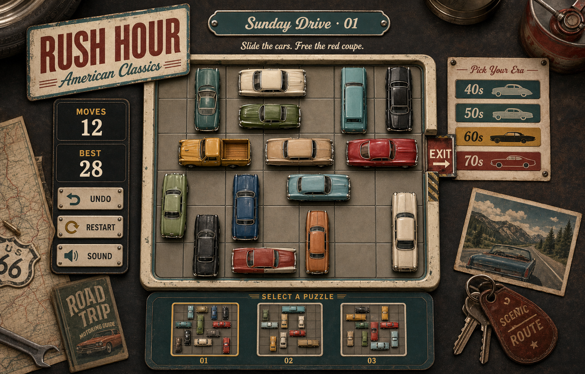

# Rush Hour — American Classics

A playable browser remake of the classic sliding-block puzzle, styled as a nostalgic American roadside garage spanning the 1940s through the 1970s.

## Play

**[Play Rush Hour — American Classics](https://rush-hour-american-classics.az9713.chatgpt.site)**

Select an automobile and move it with the brass arrow controls or your keyboard. Clear the center lane and guide the scarlet fastback through the exit.



## Features

- Three playable puzzles with verified solutions
- Classic American automobile artwork
- Mouse, touch, keyboard, and on-screen movement controls
- Undo, restart, sound, move counter, and locally saved best scores
- Responsive desktop and mobile layouts
- Four era-inspired color treatments: 1940s, 1950s, 1960s, and 1970s

## Local development

```bash
npm install
npm run dev
```

Run the checks and production build with:

```bash
npm test
npm run build
```
